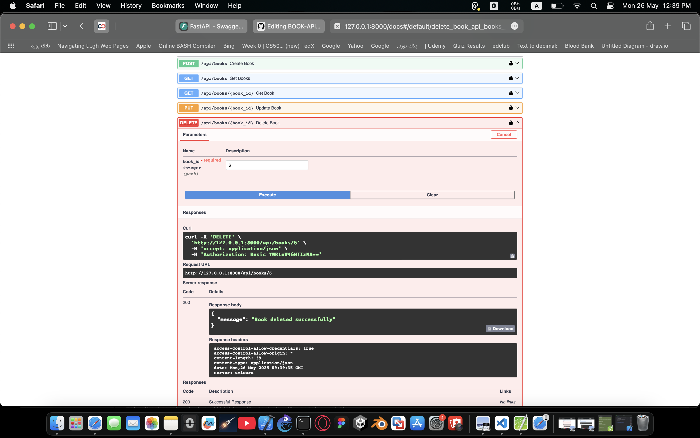

# 📚 Book Management API

A simple RESTful API for managing a collection of books, built using **FastAPI** and **SQLite**.

---

## 🚀 Features

- Create a new book  
- Get a list of all books  
- Get details of a specific book  
- Update a book’s details  
- Delete a book  
- 📸 Includes Swagger UI for testing the endpoints  
- 🔐 (Bonus-ready) Authentication can be added later

---

## 🛠️ Tech Stack

- **FastAPI** – clean and fast framework for building APIs
- **SQLite** – lightweight and easy to set up
- **Uvicorn** – ASGI server used to run the app

We chose FastAPI for its simplicity, built-in documentation, and high performance.  
SQLite was selected as the database for ease of setup and local development.

---

## 📷 Screenshots

### ✅ Swagger UI (Main Interface)
This is the automatically generated API docs from FastAPI.


---

### ✅ Create Book (POST /api/books)

You can add a book by sending title, author, publishedDate, and numberOfPages.

📸 Example:


---

### ✅ Get All Books (GET /api/books)

Lists all added books in the database.


---

### ✅ Update Book (PUT /api/books/{id})

Update title and number of pages of an existing book.


---

### ✅ Delete Book (DELETE /api/books/{id})

Deletes the book with the specified ID.



---

## 📦 How to Run Locally

1. Clone the repository:

```bash
git clone https://github.com/RenadAnwarDev/BOOK-API.git
cd BOOK-API
