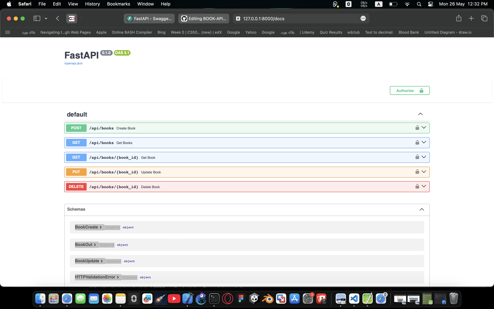

# Book Management API

## 1. Project Overview

This project is a RESTful API for managing a collection of books. It allows users to create, retrieve, update, and delete books using simple HTTP requests. The API is built using FastAPI and stores data in a SQLite database.

## 2. Technologies Used

- Python 3.13
- FastAPI framework for building APIs
- SQLite database for local storage
- Uvicorn ASGI server to run the app

## 3. How to Run the Project Locally

1. Clone the repository:

```bash
git clone https://github.com/RenadAnwarDev/BOOK-API.git
cd BOOK-API
```

2. Create and activate a virtual environment:

```bash
python3 -m venv venv
source venv/bin/activate    # macOS/Linux
venv\Scripts\activate       # Windows
```

3. Install dependencies:

```bash
pip install -r requirements.txt
```

4. Start the API server:

```bash
uvicorn main:app --reload
```

5. Open your browser and visit the API documentation:

```
http://127.0.0.1:8000/docs
```

## 4. API Endpoints

| Method | Endpoint           | Description               | Request Body                          | Response                      |
|--------|--------------------|---------------------------|-------------------------------------|-------------------------------|
| GET    | /api/books         | Retrieve all books        | None                                | List of book objects           |
| POST   | /api/books         | Create a new book         | JSON with title, author, publishedDate, numberOfPages | Created book object            |
| GET    | /api/books/{id}    | Get details of a book by ID| None                                | Book object                   |
| PUT    | /api/books/{id}    | Update a book by ID       | JSON with updated fields (title, numberOfPages) | Updated book object            |
| DELETE | /api/books/{id}    | Delete a book by ID       | None                                | Confirmation message          |

### Screenshots of API Usage

- Swagger UI main interface (auto-generated documentation):

  

- Create Book request example:

  

- Get All Books response example:

  

- Update Book request example:

  

- Delete Book request example:

  

## 5. API Documentation

This API uses FastAPI's built-in automatic documentation powered by Swagger UI. The documentation is accessible at:

```
http://127.0.0.1:8000/docs
```

From there, you can test all available endpoints interactively.

## 7. Additional Notes

- The database file `books.db` is created automatically on the first run.
- Make sure you have Python 3.7 or higher installed.
- The API is designed for learning and simple usage, not production-ready without additional security.

## 8. Contact and Repository

The source code is available at:

https://github.com/RenadAnwarDev/BOOK-API.git

Feel free to open issues or contribute.
